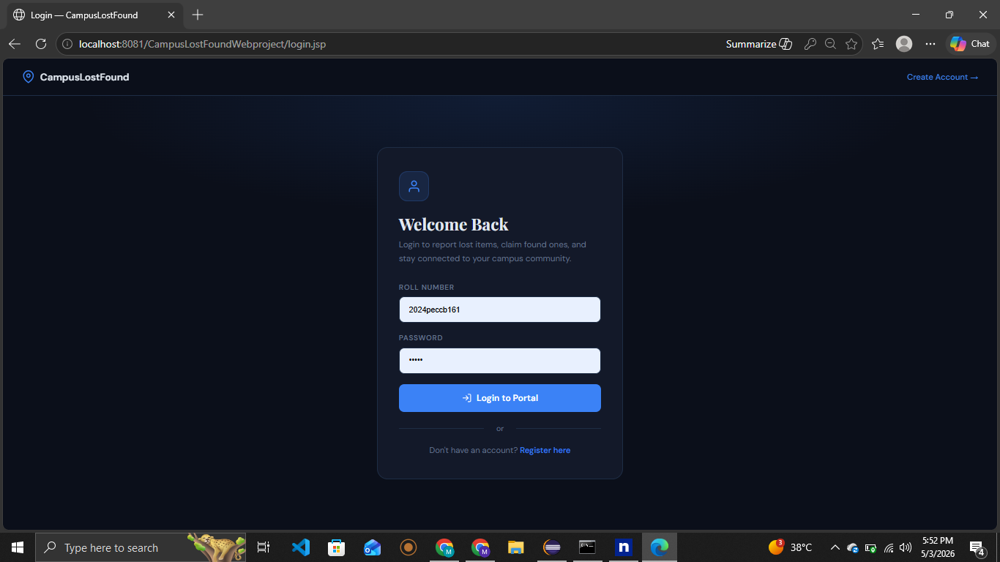
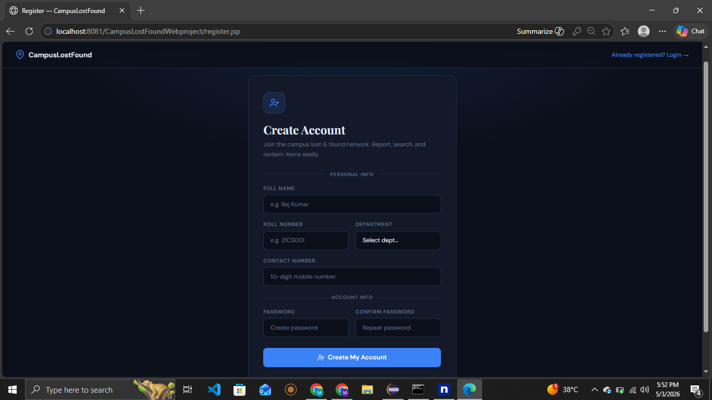
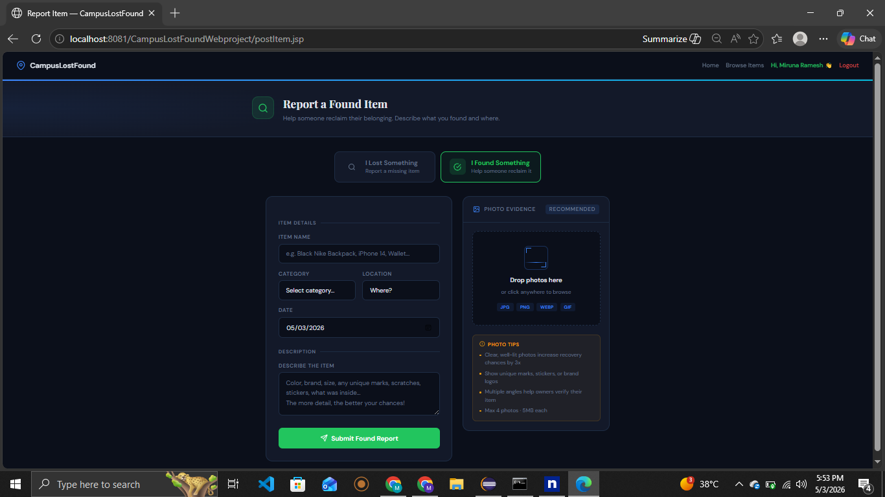
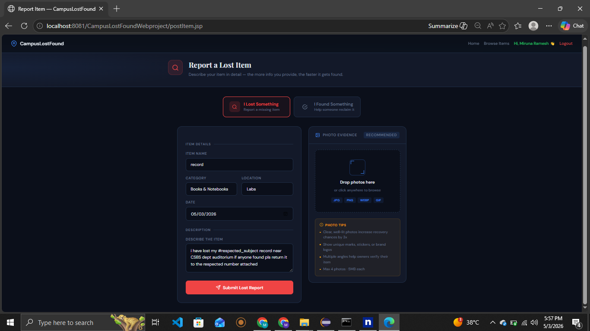
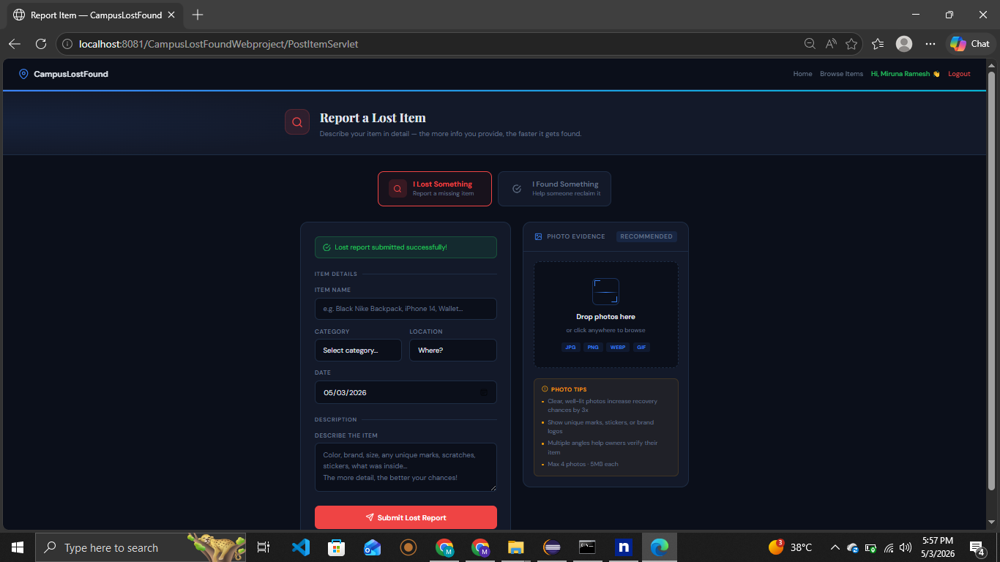
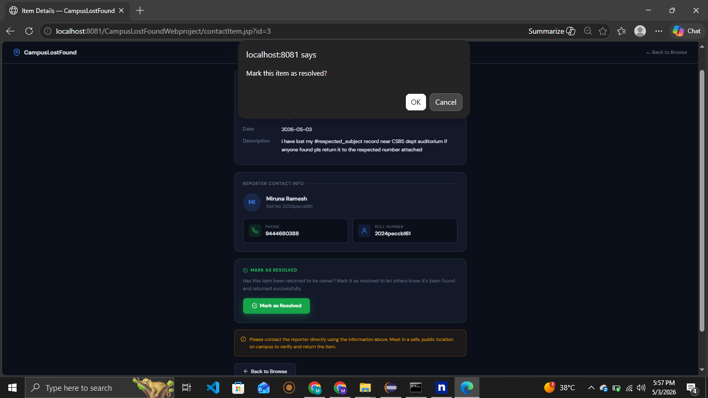

# 🎒 Campus Lost & Found Web Application

A web-based Lost and Found management system built for college campuses, allowing students to report lost items, post found items, and claim them back efficiently.

---

## 🚀 Features

- 📝 User Registration & Login
- 📦 Post Lost or Found Items
- 🔍 Search and Browse Items
- ✅ Claim & Resolve Items
- 🗑️ Delete Your Own Posts
- 📊 Dashboard with Stats
- 📱 Responsive UI

---

## 🛠️ Tech Stack

| Layer | Technology |
|-------|-----------|
| Frontend | JSP, HTML, CSS, JavaScript |
| Backend | Java Servlets |
| Database | MySQL (FreeSQLDatabase.com) |
| Server | Apache Tomcat 10.1 |
| Build Tool | Maven |
| IDE | Eclipse |

---

## 🗄️ Database Tables

- **users** — Stores registered student details
- **items** — Stores lost/found item posts
- **claims** — Stores item claim requests
- **users1** — Additional user data

---

## ⚙️ Setup Instructions

### Prerequisites
- Java 21
- Apache Tomcat 10.1
- Eclipse IDE
- MySQL (or use FreeSQLDatabase.com)

### Steps

1. **Clone the repository**
```bash
   git clone https://github.com/MirunaRamesh030207/CampusLostFound.git
```

2. **Import into Eclipse**
   - File → Import → Maven → Existing Maven Project
   - Select the cloned folder

3. **Configure Database**
   - Open `src/main/java/dao/DBConnection.java`
   - Update with your MySQL credentials:
```java
   con = DriverManager.getConnection(
       "jdbc:mysql://YOUR_HOST:3306/YOUR_DB",
       "YOUR_USERNAME",
       "YOUR_PASSWORD"
   );
```

4. **Create Database Tables**
```sql
   CREATE TABLE users (
       USER_ID INT PRIMARY KEY AUTO_INCREMENT,
       NAME VARCHAR(100),
       ROLL_NUMBER VARCHAR(20),
       CONTACT VARCHAR(15),
       DEPARTMENT VARCHAR(50),
       EMAIL VARCHAR(100),
       PASSWORD VARCHAR(100)
   );

   CREATE TABLE items (
       ITEM_ID INT PRIMARY KEY AUTO_INCREMENT,
       USER_ID INT,
       TYPE VARCHAR(10),
       CATEGORY VARCHAR(50),
       DESCRIPTION VARCHAR(500),
       LOCATION VARCHAR(100),
       DATE_POSTED DATE,
       STATUS VARCHAR(10),
       IMAGE_NAME VARCHAR(200),
       ITEM_NAME VARCHAR(200)
   );

   CREATE TABLE claims (
       CLAIM_ID INT PRIMARY KEY AUTO_INCREMENT,
       ITEM_ID INT,
       CLAIMED_BY INT,
       CLAIM_DATE DATE,
       VERIFIED TINYINT(1)
   );

   CREATE TABLE users1 (
       ID INT PRIMARY KEY AUTO_INCREMENT,
       NAME VARCHAR(100),
       ROLLNUMBER VARCHAR(50),
       CONTACT VARCHAR(50),
       DEPARTMENT VARCHAR(50)
   );
```

5. **Add MySQL JAR**
   - Download `mysql-connector-j-8.0.33.jar`
   - Place in `src/main/webapp/WEB-INF/lib/`

6. **Run on Server**
   - Right click project → Run As → Run on Server
   - Select Apache Tomcat 10.1

7. **Access the app**
http://localhost:8081/CampusLostFoundWebproject/index.jsp

---

## 📸 Screenshots

### 🏠 Home Page (Before Register)


### 🏠 Home Page (After Registration)


### 🔐 Login Page


### 🆕 Create Account


### 📦 Post Found Item


### ❗ Report Lost Item


### 📤 Report Submission


### 📞 Contact Owner



## 👩‍💻 Developer

**Miruna Ramesh**
- GitHub: [@MirunaRamesh030207](https://github.com/MirunaRamesh030207)

---

## 📄 License

This project is for educational purposes only.
